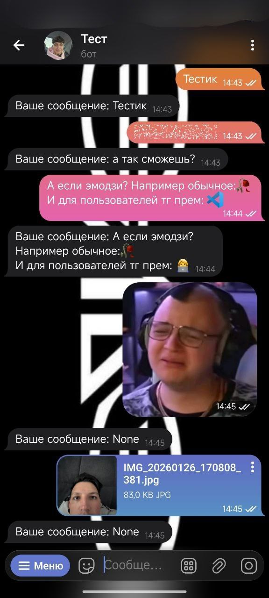

# Репозиторий по изучению aiogram3

Данный репозиторий я делаю для себя что бы повторить материал и для тех кому не понятно обьяснение в интернете

# Содержание
1. [Настройка бота в BotFather](#настройка-бота-в-botfather)
2. [Создание echo бота](#создание-echo-бота)
3. Импорты
4. Обработчик команд
5. Reply кнопки
6. Inline кнопки
7. FSMContext
8. Работа с базами данных 
---
# Настройка бота в BotFather
Для начала нам нужно получить токен нашего бота.  
Что бы получить токен переходим в бота @BotFather это официальный бот от телеграмм
## Создание бота
Раньше Бота нужно было создавать через команды в BotFather теперь это можно сделать в удобной мини апке
1. Нажимаем "open" слева от клавиатуры
2. Нажимаем "Create a New Bot"
3. Придумываем имя нашему боту допустим "Bot exemple 42"
4. Можно сделать описание для нашего бота в строчке "About" (необязательно)
5. Придумываем уникальный username для нашего бота. Username должен быть без пробелов и обязательно оканчиваться на "bot". Например example_42bot
6. Нажимаем "Создать" и всё!  
Теперь настроем нашего бота
## Обзор настроек
Мы видем что в списке ботов появился наш только что созданый бот, нажимаем на него и видим всю информацию о нём.  
Сверху мы видим фото нашего бота, название и username. Если фото нет то вы можите его установить об этом мы поговорим чуть позже.  
Ниже мы видим странную строчку с "плавующими точками", а если нажмём на эту строчку то увидим последовательность символов - токен нашего бота.  
Под токеном есть две кнопки Copy и Revoke. Они копируют и заново генирируют токен соответственно.  
ВНИМАНИЕ токен бота должны знать только вы если вы показали его кому-то другому или случайно опубликовали его на gitHub бегите нажимать кнопку Revoke.  
Ниже мы видим меню Settings разберём его по порядку
1. Edit info  
В нём мы можем изменить информацию о нашем боте.  
Например изменить фото, добавить описание и т. п.
2. Commands  
Здесь мы можем добавить команды для быстрого доступа пользователю.  
 
Для того что бы он не вводил "/example_command_4243_give_me_my_id", а просто нажал на кнопку над клавиатурой и эта команда отправилась боту
3. mini apps  
Этот раздел я ещё сам полохо знаю, возможно он вообще не будет рассматриваться в данном репозитории
4. Bot Settings  
В этом раздели остались остальные настройки бота которые скорее всего вам не понадобятся
5. Games  
Это меню где можно настроить мини игры в нашем боте.  
Переходим к следующему разделу
## Monetization
1. Payments  
В этом разделе можно подключить оплату онлайн покупок.  
Где это используется:  
Например вам нужно создать бота который отображает каталог магазина. В магазине само собой есть тавары и вот тут мы подключаем оплату.  
Или например нам нужно создать бота который будет консультировать по услугам косметолога и в конце консультации предложит записаться на услугу и сделать предоплату
2. Telegram Stars  
В этом разделе нас перенесёт на страницу о Stars.  
Коротко о Stars (дальше я буду называть их звёздами) - Это внутренняя валюта в телеграмм. Если вы часто пользуетесь телеграмом вы 100% видели подарки в профиле у пользователей или сами являетесь владельцем таких подарков. Такие подарки покупаются именно за звёзды. Так же за звёзды можно купить телеграмм премиум, писать пользователям у которых стоят сообщения за звёзды и много чего ещё, в том числе оплачивать покупки в ботах.  
Например вы заплотили 25 звёзд и бот отправил вам картинку "Спасибо<3"  

Дальше находятся кнопки которые передают бота другому пользователю и удаляют его, но нам они не понадобятся.  
На этом всё, настройка бота закончена переходим к созданию скрипта
# Создание echo бота
Перед тем как мы создадим нашего первого бота, поговорим ос структуре проекта
## Структура проекта
Для насала в папке нашего проекта создаём файл с токеном нашего бота.  
Пусть он будет называться "BOTTOKEN"  
В нём создаём переменную "TOKEN" в которую мы записываем строку с токеном бота [где взять токен](#настройка-бота-в-botfather)  
`TOKEN = 'example_token_42'` Наш файл сразу можно записать в .gitignore если вы хотите опубликовать его на gitHub  
Теперь создаём новый файл который будет запускать нашего бота например "run.py"  
В нём мы импортируем обьекты из aiogram про импорты мы поговорим позже сейчас мы разбираем структуру проекта  
Нам нужно импортировать Dispatcher и Bot, а так же библиотеку asyncio т. к. aiogram это ассинхронная библеотека
На данном этапе наши импорты будут выглядеть так:  
```
from aiogram import Dispatcher, Bot
from BOTTOKEN_LESS1 import TOKEN1
import asyncio
```  
Не забываем установить наши библиотеки через pip install  
Теперь создаём ассинхронную функцию main  
В ней создаём переменную dp в которую записываем диспетчер и переменную bot в которую записываем Bot и в него передаём токен нашего бота  
Далее мы записываем такую конструкцию:  
```
    dp.include_router(router) # про роутеры мы поговорим ниже
    await dp.start_polling(bot)
```  
В ней мы начинаем хост нашего бота
В конце мы записываем стандартную конструкцию `if __name__ == '__main__':`  в которой запускаем нашего бота если файл не импортируется  
```
if __name__ == "__main__":
    try:
        asyncio.run(main()) 
    except:
        print("Завершение работы")
```  
На этом с файлом run.py мы закончим но ещё вернёмся  
Теперь создалим файл routes.py в котором будут храниться наши роутеры  
В нём мы делаем импорты (Прео импорты поговорим позже)  
```
from aiogram import Router
from aiogram.types import Message
```  
затем создаём переменную router в которую передаём наш Router()  
Теперь начинается самое интересное - создание роутеров
## Создание роутеров
И так что бы создать роутер нам нужно написать собаку затем передать наш роутер и обратиться к message  
В роутер мы можем передать то на что должен реагировать наш роутер (Например на сообщение или фото и т. п.)  
Но мы ничего передавать не будем и наш роутер будет реагировать на всё  
дальше мы создаём ассинхронную функцию echo, название может быть любым, но т. к. мы делаем echo бота мы назовём её именно так  
В ней мы создаём/передаём переменную message и подставляем соответствующий ей класс Message, этого можно не делать но так будет правельнее  
В нашей функции мы делаем await и обращаемся к нашей переменной message и затем обращаемся к такой функции answer. С помощью этой функции мы можем ответить на сообщение нашего пользователя например отправить текст "hello world" или отправить картинку и т. п. . Мы же будем отправлять пользователю его же сообщение доказательсттво того что бот может прочесть текст от пользователя. Делать это мы будем через message.text можно делать это через f строчку f"Ваше сообщение: {message.text}" или просто отправить его сообщение без подписи(message.text)  
Вот и всё наш первый роутер готов  
Вот как то так будет выглядеть наш файл:  
```
from aiogram import Router
from aiogram.types import Message
router_less1 = Router()


@router_less1.message()
async def echo(message: Message):
    await message.answer(f"Ваше сообщение: {message.text}")
```  
Теперь возвращаемся к файлу run.py и импортируем там наш файл с роутерами и передаём наш роутер в dp.include_router  
На этом всё наш бот готов можно запускать наш файл run.py  
P. S. Советою занисти папку pycache в .gitignore `__pycache__/`  
